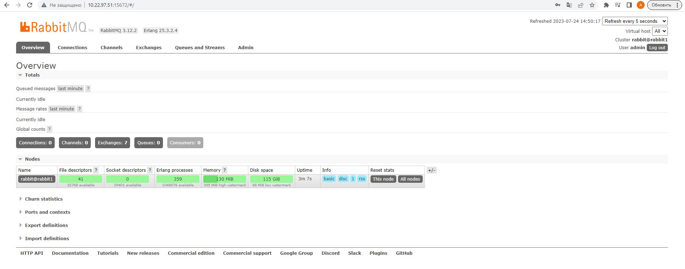
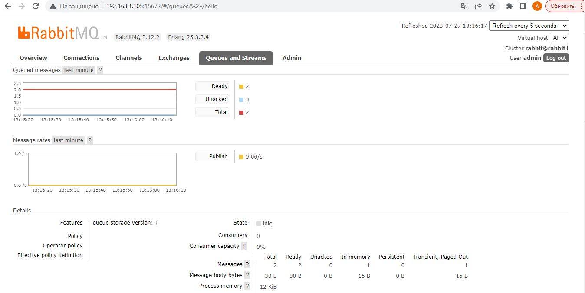
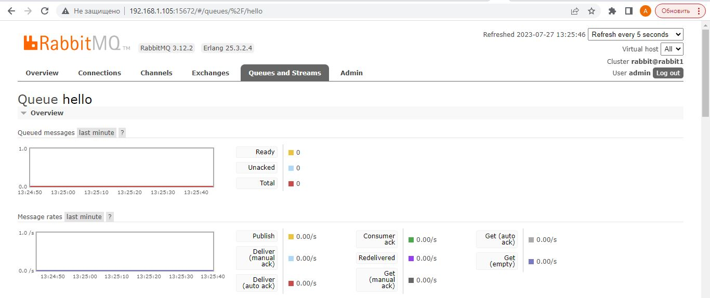
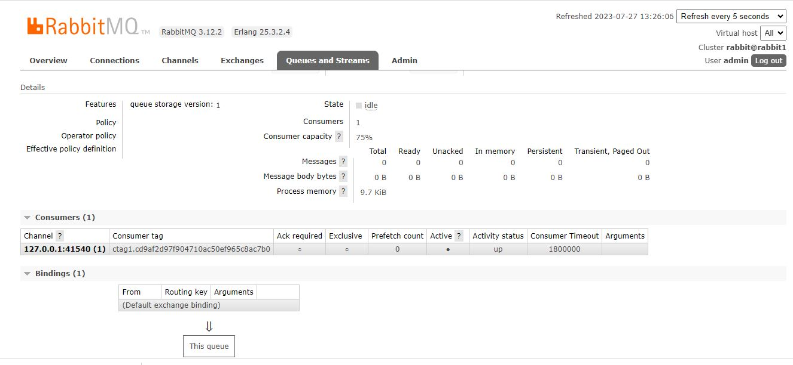
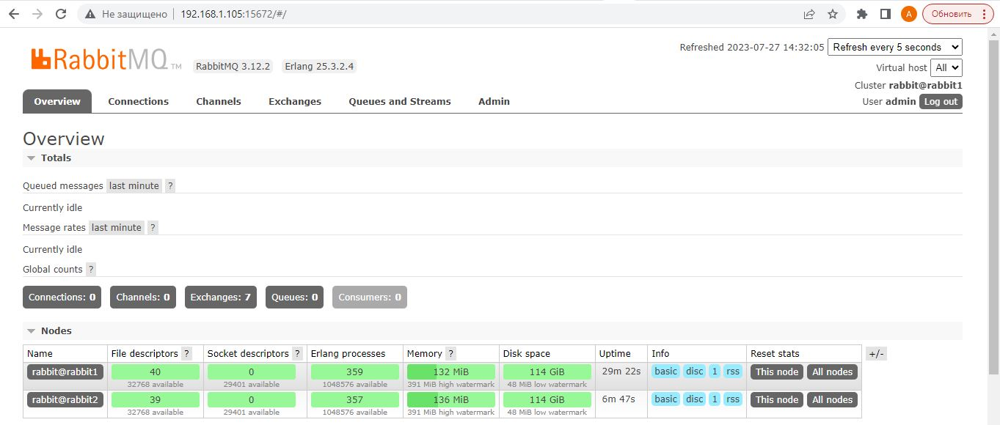
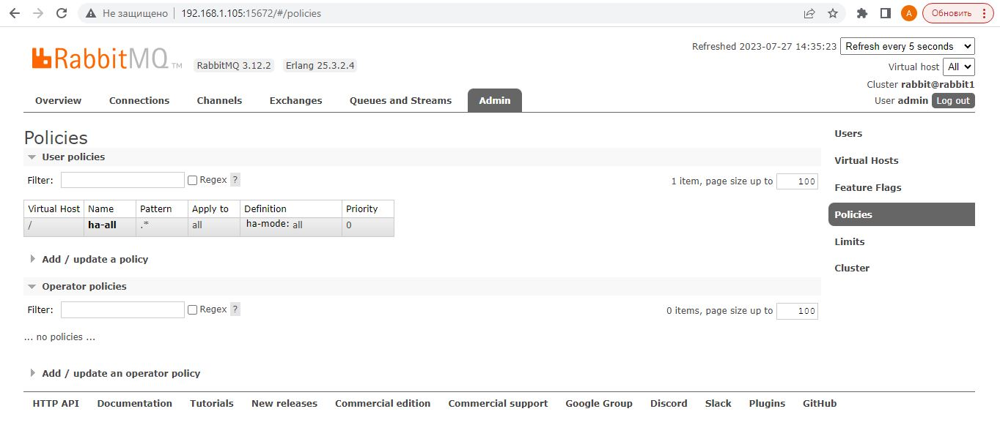
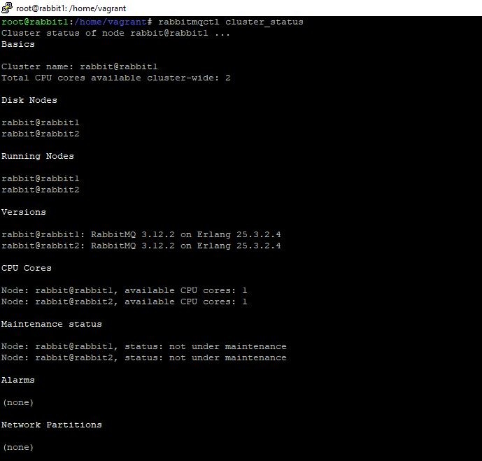
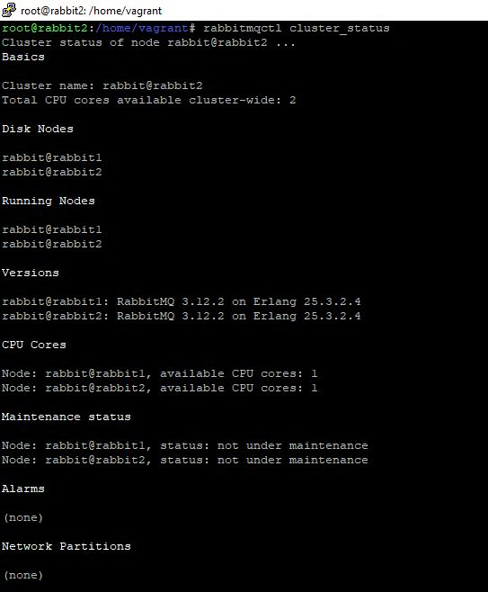

# Домашнее задание к занятию  «Очереди RabbitMQ», Лебедев А. И., FOPS-10

---

### Задание 1. Установка RabbitMQ

Используя Vagrant или VirtualBox, создайте виртуальную машину и установите RabbitMQ.
Добавьте management plug-in и зайдите в веб-интерфейс.

*Итогом выполнения домашнего задания будет приложенный скриншот веб-интерфейса RabbitMQ.*


### Решение:  

 - Воспользуемся инструкцией, которую предлагает нам Google и установим RabbitMQ на одну машину: **https://losst.pro/ustanovka-rabbitmq-v-ubuntu-20-04**.

 - В нашем случае, это Debian 11, но все получилось:

     

 ---

### Задание 2. Отправка и получение сообщений

Используя приложенные скрипты, проведите тестовую отправку и получение сообщения.
Для отправки сообщений необходимо запустить скрипт producer.py.

Для работы скриптов вам необходимо установить Python версии 3 и библиотеку Pika.
Также в скриптах нужно указать IP-адрес машины, на которой запущен RabbitMQ, заменив localhost на нужный IP.

```shell script
$ pip install pika
```

Зайдите в веб-интерфейс, найдите очередь под названием hello и сделайте скриншот.
После чего запустите второй скрипт consumer.py и сделайте скриншот результата выполнения скрипта

*В качестве решения домашнего задания приложите оба скриншота, сделанных на этапе выполнения.*

Для закрепления материала можете попробовать модифицировать скрипты, чтобы поменять название очереди и отправляемое сообщение.

  

### Решение:    

 - Данное задание, также, не составило большого труда за исключением одного момента. При вводе в скрипт адреса, отличного от 127.0.0.1, скрипт плевался ошибкой. Но, т.к. в этом задании не стояло сверх задачи и мы работали на одной машине, я использовал 127.0.0.1 в скрипте и все удалось.
В очередь я отправил несколько одинаковых сообщений:

Вид очереди в веб-интерфейсе после выполнения скрипта producer.py:  

    

Вид очереди в веб-интерфейсе после выполнения скрипта consumer.py:  

   

     

Вид из терминала:  

   

Все задачи выполнены и мы приступаем к самому интересному.


 ---

### Задание 3. Подготовка HA кластера

Используя Vagrant или VirtualBox, создайте вторую виртуальную машину и установите RabbitMQ.
Добавьте в файл hosts название и IP-адрес каждой машины, чтобы машины могли видеть друг друга по имени.

Пример содержимого hosts файла:
```shell script
$ cat /etc/hosts
192.168.0.10 rmq01
192.168.0.11 rmq02
```
После этого ваши машины могут пинговаться по имени.

Затем объедините две машины в кластер и создайте политику ha-all на все очереди.

*В качестве решения домашнего задания приложите скриншоты из веб-интерфейса с информацией о доступных нодах в кластере и включённой политикой.*

Также приложите вывод команды с двух нод:

```shell script
$ rabbitmqctl cluster_status
```

Для закрепления материала снова запустите скрипт producer.py и приложите скриншот выполнения команды на каждой из нод:

```shell script
$ rabbitmqadmin get queue='hello'
```

После чего попробуйте отключить одну из нод, желательно ту, к которой подключались из скрипта, затем поправьте параметры подключения в скрипте consumer.py на вторую ноду и запустите его.

*Приложите скриншот результата работы второго скрипта.*  

 ### Решение:  

 - Первым делом, поднимем RabbitMQ на второй машине (я проделал все те же действия, завёл администратора с теми же данными и включил *rabbitmq-plugins enable rabbitmq_management*). Ок.

 - Идем в hosts на первой и второй машине и прописываем соответствия ip-адреса доменному имени:

```
echo "192.168.1.105 rabbit1" >> /etc/hosts
echo "192.168.1.88 rabbit2" >> /etc/hosts

```  

- Следующий важный момент. Для работы кластера RabbitMQ все узлы, участвующие в кластере, должны иметь одинаковые файлы cookie.  
Скопируйте содержимое файла Cookie с первой (main) машины (ноды) на вторую, которую будем добавлять в кластер.
Файл Cookie находится здесь: */var/lib/rabbitmq/.erlang.cookie*.  
Убедившись, что содержимое файлов одинаковое, продолжим.

- На **второй ноде (rabbit2)** перезапустим службу:  

```
systemctl restart rabbitmq-server
```

- Остановим и сбросим приложение:

```
rabbitmqctl stop_app
rabbitmqctl reset
```  

 ...подключим к кластеру и запустим:  

```  
rabbitmqctl join_cluster rabbit@rabbit1

rabbitmqctl start_app
```

- На **ноде1 (rabbit1)** cоздаем политику, которая позволяет зеркалировать очереди для всех узлов в кластере:  

```
rabbitmqctl set_policy ha-all ".*" '{"ha-mode":"all"}'  
```  

- Смотрим, что получилось:

   

     

   

 
